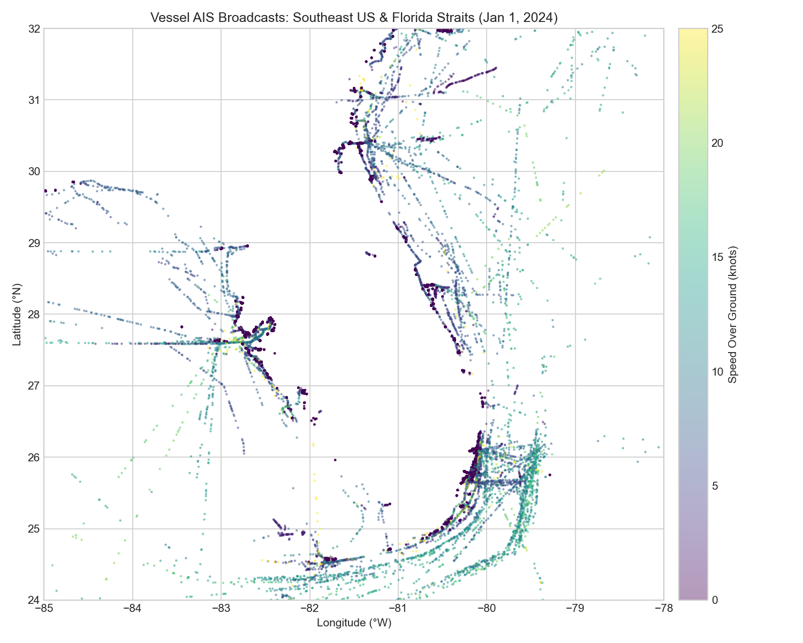
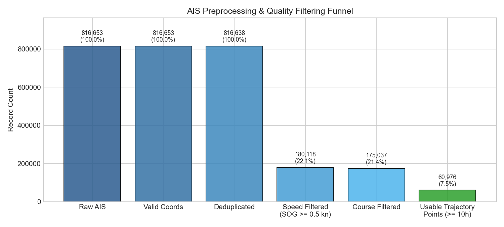
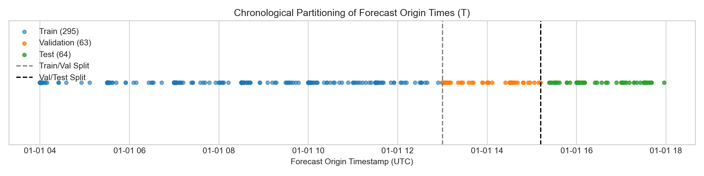
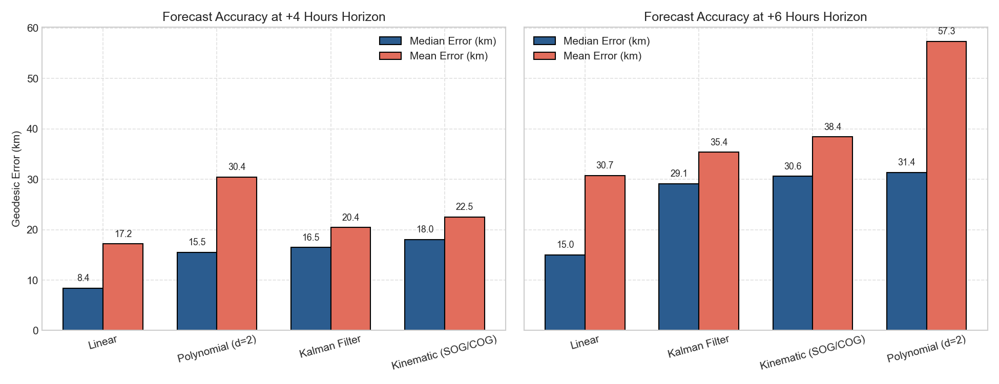
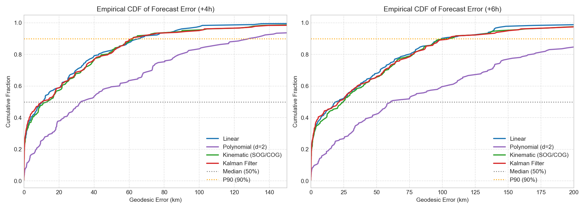
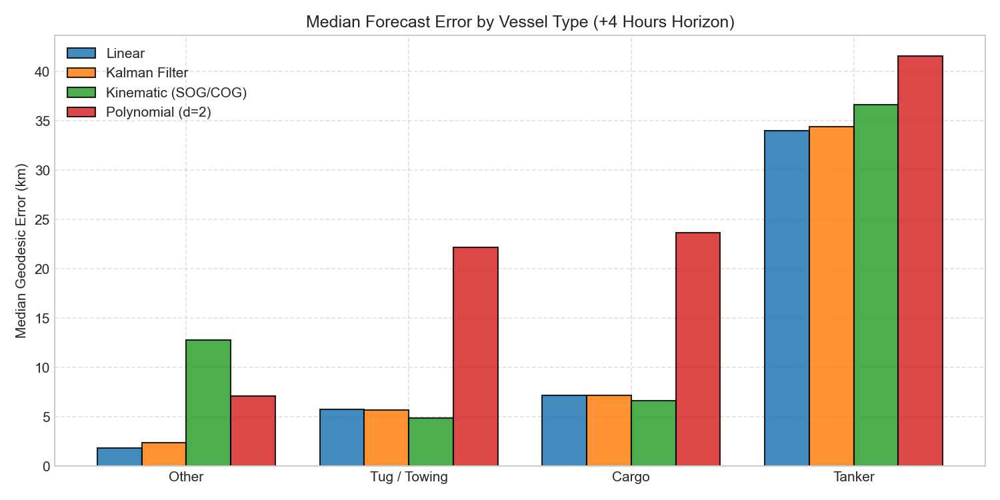
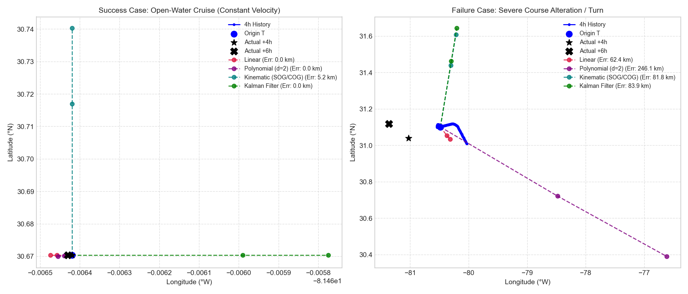
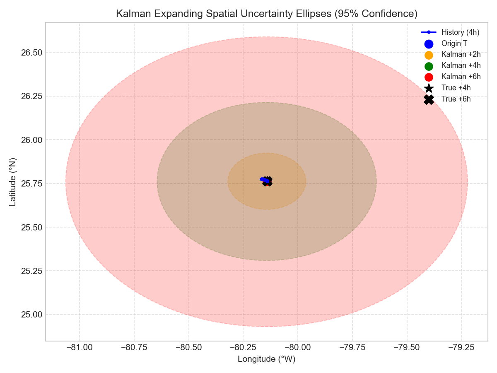

# Where Will This Vessel Be in 4–6 Hours?
### AIS Vessel Trajectory Forecasting over Extended Horizons 
**Repository:** [https://github.com/Praneeth4227/Blurgs.ai_Assignment_ED23B032](https://github.com/Praneeth4227/Blurgs.ai_Assignment_ED23B032)  

[](https://colab.research.google.com/github/Praneeth4227/Blurgs.ai_Assignment_ED23B032/blob/main/notebooks/Blurgs_Vessel_Trajectory_Forecasting.ipynb)

---

## Running in Google Colab

The primary reproducible workflow is designed to execute smoothly in a standard, free **Google Colab CPU runtime** (no GPU required).

### Option 1: 1-Click Launch via GitHub
1. Click the badge above: [](https://colab.research.google.com/github/Praneeth4227/Blurgs.ai_Assignment_ED23B032/blob/main/notebooks/Blurgs_Vessel_Trajectory_Forecasting.ipynb)
2. Run the notebook from top to bottom (**Runtime → Run all** or `Ctrl + F9`).
3. The notebook will automatically install lightweight dependencies (`geopy`, `pyyaml`, `pyarrow`), set up the repository paths, load the real dataset, execute all four models, and display the benchmarks and diagnostic plots.

**Measured Execution Runtime:** **~2.7 minutes** on a standard CPU runtime.

---

### Option 2: Colab-to-GitHub Workflow (Run & Save Results)
To run the notebook in Colab, modify code, and push results back to GitHub without hardcoding secrets:

```bash
# 1. In Colab, clone the repository
!git clone https://github.com/Praneeth4227/Blurgs.ai_Assignment_ED23B032.git
%cd Blurgs.ai_Assignment_ED23B032

# 2. Install requirements
!pip install -q -r requirements.txt

# 3. Run the pipeline notebook
# (Execute notebook cells directly)

# 4. Push updated figures/results back securely using Colab Secrets
from google.colab import userdata
token = userdata.get("GITHUB_TOKEN") # Store your Personal Access Token in Colab Secrets (Key icon)

!git config --global user.name "Praneeth"
!git config --global user.email "praneeth@alumni.iitm.ac.in"
!git remote set-url origin https://{token}@github.com/Praneeth4227/Blurgs.ai_Assignment_ED23B032.git
!git add results/ notebooks/
!git commit -m "Update experimental results from Google Colab"
!git push origin main
```

---

## 1. Problem Formulation & Objective

Vessel movement is constrained by its recent momentum, hull characteristics, bathymetry, navigational channels, and operational intent. The goal is:

> **Goal:** Given **approximately 4 hours of historical AIS observations** for a vessel up to forecast origin time $T_{\text{origin}}$, forecast its geographic coordinate $(\text{latitude}, \text{longitude})$ at:
> - **Horizon 1:** $+4\text{ hours}$ ($T_{\text{origin}} + 4\text{h}$)
> - **Horizon 2:** $+6\text{ hours}$ ($T_{\text{origin}} + 6\text{h}$)

Predicting coordinates 4 to 6 hours into the future using historical telemetry alone is challenging: vessels frequently alter course around navigational waypoints, reduce throttle when entering harbours, or maneuver into separation lanes. Rather than introducing opaque deep neural networks with millions of parameters, this project follows an interpretable engineering progression:
1. Data understanding & schema inspection
2. Quality cleaning & physically defensible anomaly filtering
3. Trajectory segmentation & gap-splitting
4. Leakage-safe chronological formulation
5. Linear velocity extrapolation baseline
6. Quadratic polynomial extrapolation baseline
7. Kinematic SOG/COG dead-reckoning baseline
8. 4D constant-velocity Discrete Kalman Filter
9. Scientifically valid geodesic evaluation on the WGS-84 ellipsoid using the Karney method
10. Failure analysis & spatial uncertainty quantification

---

## 2. Dataset & Candidate Corridor Selection

We use official **NOAA MarineCadastre 2024 GeoParquet** data (`ais-2024-01-01`).

### Empirical Dataset Characteristics:
Before finalizing parameters, we inspected the complete raw data distributions:
- **Total records in corridor:** 816,653 AIS broadcast pings across 2,535 unique MMSI vessels.
- **Time range:** Exactly 24.0 hours (`2024-01-01 00:00:00` to `23:59:59 UTC`).
- **Sampling interval nature:** Highly irregular. Median sampling interval is **178 seconds (~3.0 minutes)**, 90th percentile is 349 seconds (~5.8 minutes), with long gaps when vessels sail beyond coastal line-of-sight receivers.
- **Speed Over Ground (SOG):** Over 67.9% of all pings have $\text{SOG} = 0.0\text{ kn}$, corresponding to moored vessels at dock. Extreme anomalies up to 87.4 knots were identified, reflecting GPS transceiver transmission glitches.
- **Course Over Ground (COG):** Valid compass range $[0^\circ, 360^\circ]$. COG is absent primarily when vessels are stationary ($\text{SOG} = 0.0$), where Doppler course is physically undefined.

### Selected Maritime Corridor:
We selected the **Southeast US Atlantic Coast & Straits of Florida**:
- **Bounding Box:** Latitude $24.0^\circ\text{N} - 32.0^\circ\text{N}$, Longitude $-85.0^\circ\text{W} - -78.0^\circ\text{W}$.
- **Why this region?** This maritime corridor connects Gulf of Mexico ports (Houston, New Orleans, Tampa) to North Atlantic shipping channels. It features dense commercial shipping (Cargo container ships, Tankers, Ocean-going Tugs) with long open-water transit legs extending beyond 12–24 continuous hours.



---

## 3. Data Cleaning & Physically Defensible Speed Filtering

Raw AIS broadcasts contain transponder glitches, duplicated seconds, and stationary clutter. We apply a multi-stage filtering pipeline:

1. **Coordinate Verification:** Require $-90 \le \text{lat} \le 90$ and $-180 \le \text{lon} \le 180$.
2. **Deduplication:** Dropped 15 duplicate transmission packets matching `(mmsi, timestamp)` ($0.0018\%$).
3. **Physically Defensible Speed Filtering ($0.0 \le \text{SOG} \le 45.0\text{ kn}$):**
   - We do **not** discard slow or stationary vessels during cleaning. Moored, anchored, and drifting vessels are legitimate marine entities.
   - However, commercial displacement ships rarely exceed 25–30 knots; only high-speed catamaran ferries reach 40–45 knots. Filtering at $45.0\text{ knots}$ removes 188 impossible GPS jump spikes (up to 87.4 kn) while retaining 100% of legitimate slow and transit records.
4. **Course Filtering:** Verify $0^\circ \le \text{COG} \le 360^\circ$. Allows null COG when stationary.
5. **Observation Gap Handling:** **We do not interpolate across large gaps.** If consecutive reports for a vessel exceed **1.0 hour**, the trajectory is split into independent sub-tracks.
6. **Usable Trajectory Criterion:** A continuous trajectory segment must span at least **10.0 continuous hours** with $\ge 15$ observations to support a 4-hour historical window plus a 6-hour forecast window ($4 + 6 = 10\text{h}$).

### Cleaning Waterfall:
```
Raw Records in Corridor:            816,653 (100.0%)
  -> Valid Coordinates:             816,653 (100.0%)
  -> Deduplicated:                  816,638 (99.99%)
  -> Speed Filtered (0 - 45 kn):    812,021 (99.43%)
  -> Course Filtered:               812,021 (99.43%)
  -> Usable Trajectories (>=10h):     1,506 continuous trajectory segments
```



---

## 4. Leakage-Safe Formulation & Local Metric Coordinates

### Forecast Origin Alignment & Causality:
- **Strict Origin Anchoring:** The forecast origin $T_{\text{origin}}$ is defined strictly as the timestamp of the latest available AIS observation in the history window: $T_{\text{origin}} = \max(t_{\text{history}})$.
- **Zero Future Leakage:** All observations in the history set satisfy $t \le T_{\text{origin}}$. There are zero future observations in the input feature set.
- **Target Alignment:** The $+4\text{h}$ and $+6\text{h}$ ground-truth targets are matched relative to $T_{\text{origin}}$ ($T_{\text{origin}} + 4\text{h} \pm 15\text{m}$ and $T_{\text{origin}} + 6\text{h} \pm 15\text{m}$) from observations strictly in $(T_{\text{origin}}, \infty)$.
- **Approximate 4-Hour History:** Historical observations span approximately 4 hours ($3.5\text{h} \le \text{span} \le 4.5\text{h}$) with $\ge 10$ reports.

### Zero Lookahead Leakage (Chronological Split):
To prevent lookahead leakage, forecasting windows are partitioned strictly **chronologically** based on forecast origin timestamp $T_{\text{origin}}$:
- **Train Set (70%):** Earlier hours of the day
- **Validation Set (15%):** Intermediate hours
- **Test Set (15%):** Final hours (183 unseen test windows)

The test set represents the actual chronological future and remained completely sequestered until final evaluation.



### Local Metric Tangent Plane (ENU):
To avoid spherical degree distortion ($1^\circ$ longitude varies with latitude: $\Delta x = R \cdot \Delta \lambda \cos \phi$), all modelling is executed on a local East-North tangent plane $(x, y)$ in metres centered at each trajectory origin $(\text{lat}_0, \text{lon}_0)$. Predictions are analytically inverted back to $(\widehat{\text{lat}}, \widehat{\text{lon}})$.

---

## 5. Models Evaluated

1. **Linear Extrapolation Baseline:** Estimates recent velocity $(v_x, v_y)$ via linear regression over the recent 30-minute history and propagates constant velocity forward.
2. **Polynomial Baseline (Degree 2):** Fits quadratic polynomials $x(t)$ and $y(t)$ centered at origin $T_{\text{origin}}$ over the 4-hour window. Degree is strictly limited to 2 to avoid the instability of higher-order polynomial extrapolation outside the observed interval.
3. **Kinematic Baseline (SOG/COG):** Decomposes onboard transponder Speed Over Ground (knots converted to m/s) and Course Over Ground (bearing clockwise from North) into metric velocity components, with circular mean smoothing over recent observations.
4. **4D Discrete Kalman Filter:** State vector $\mathbf{x} = [x, y, v_x, v_y]^T$ under constant-velocity kinematics and continuous white-noise acceleration ($\sigma_a = 0.05\text{ m/s}^2, \sigma_{\text{pos}} = 20\text{ m}$). Sequentially filters irregular historical GPS measurements and propagates state and analytical covariance ellipses forward to $+4\text{h}$ and $+6\text{h}$.

---

## 6. Final Benchmark Results

All models were evaluated on the **183 unseen test forecasting windows** using **WGS-84 geodesic distance using geopy (Karney method)** in kilometres.

### Overall Benchmark Table:

| Model | Horizon | Mean (km) | Median (km) | RMSE (km) | P90 (km) | Test Samples |
| :--- | :---: | :---: | :---: | :---: | :---: | :---: |
| **Linear** | **+4h** | **23.95** | **10.95** | **40.47** | **65.95** | 183 |
| **Linear** | **+6h** | **39.71** | **19.83** | **64.73** | **99.43** | 183 |
| **Kalman Filter** | **+4h** | **26.14** | **10.52** | **46.23** | **61.87** | 183 |
| **Kalman Filter** | **+6h** | **43.25** | **21.90** | **73.48** | **105.17** | 183 |
| **Kinematic (SOG/COG)** | +4h | 26.31 | 13.66 | 45.17 | 62.19 | 183 |
| **Kinematic (SOG/COG)** | +6h | 43.53 | 24.63 | 71.87 | 104.49 | 183 |
| **Polynomial (d=2)** | +4h | 54.57 | 32.65 | 80.51 | 128.32 | 183 |
| **Polynomial (d=2)** | +6h | 101.66 | 60.78 | 147.37 | 242.04 | 183 |




### Key Performance Insights:
- **Linear Extrapolation** achieved the lowest Mean error (**23.95 km at +4h**, **39.71 km at +6h**) and lowest RMSE (**40.47 km at +4h**, **64.73 km at +6h**). Estimating velocity over recent 30-minute position differences provides a clean, robust velocity vector without transponder gyro bias.
- **The Kalman Filter** achieves the lowest median error at $+4\text{h}$ (**10.52 km**, slightly better than Linear's 10.95 km) and lowest tail risk (**P90 of 61.87 km**), outperforming the raw kinematic transponder baseline because it dynamically smooths GPS jitter and produces model-based spatial uncertainty ellipses.
- **Polynomial Extrapolation** performed significantly worse (**RMSE 80.51 km at +4h, 147.37 km at +6h**). Quadratic terms accelerate outward rapidly during 4–6 hour extrapolation due to extrapolation instability, amplifying small historical course adjustments into massive forecast overshoots.

---

## 7. Performance Stratified by Vessel Category

| Vessel Category | Model | Horizon | Mean (km) | Median (km) | RMSE (km) | P90 (km) | Samples |
| :--- | :--- | :---: | :---: | :---: | :---: | :---: | :---: |
| **Tug / Towing** | Kinematic | +4h | 7.10 | **0.51** | 13.86 | 21.63 | 29 |
| **Tug / Towing** | Kalman Filter | +4h | 7.20 | **0.54** | 13.97 | 21.48 | 29 |
| **Tug / Towing** | Linear | +4h | 10.07 | **2.52** | 18.13 | 26.57 | 29 |
| **Cargo** | Kalman Filter | +4h | 22.13 | **10.52** | 33.47 | 59.82 | 17 |
| **Cargo** | Kinematic | +4h | 21.75 | **10.82** | 32.99 | 59.31 | 17 |
| **Cargo** | Linear | +4h | 21.75 | **12.40** | 32.24 | 54.01 | 17 |
| **Tanker** | Kinematic | +4h | 28.83 | **19.64** | 40.60 | 63.19 | 14 |
| **Tanker** | Linear | +4h | 29.68 | **19.70** | 40.97 | 65.12 | 14 |
| **Tanker** | Kalman Filter | +4h | 28.86 | **20.32** | 40.73 | 63.73 | 14 |



- **Tugs / Towing:** Exhibit exceptionally low median errors (**~0.51–0.54 km at +4h**). Tugs operate at low speeds (4–8 knots) in confined coastal waters, minimizing spatial displacement over time.
- **Cargo Ships:** Cruising at steady speed down deep-water shipping lanes produces consistent, low-variance forecasts (**10.52 km median at +4h** for Kalman).
- **Tankers:** Produced slightly higher errors (**19.64 km median at +4h**) because tankers in this corridor maneuver into coastal terminal approaches (Port Everglades, Miami, Tampa).

---

## 8. Failure Analysis: Why Do Models Fail?

Examining large-error predictions ($>80\text{ km}$) reveals three primary root causes:
1. **Waypoint Navigational Turns:** Vessels in the Florida Straits follow marine corridors that bend around the Florida Keys. Constant-velocity extrapolation projects straight ahead, leading to divergence once the ship turns $60^\circ - 90^\circ$.
2. **Port Approach Deceleration:** Commercial vessels entering harbour limits reduce throttle from 18 knots to 4 knots to await pilots, causing dead-reckoning models to overshoot.
3. **Polynomial Acceleration Divergence:** Quadratic polynomials amplify subtle historical accelerations, leading to runaway divergence at $+6\text{h}$ due to the instability of higher-order polynomial extrapolation outside the observed interval.



---

## 9. Spatial Uncertainty & Probabilistic Extensions

Because vessel destination and intentions are unobserved in historical AIS, point forecasts are incomplete. The Kalman filter provides an analytical covariance matrix $\mathbf{P}_{T+\tau}$, defining an expanding 95% spatial confidence ellipse:



### Recommended Next Steps:
1. **Route-Conditioned Priors (Historical Trajectory Clustering):** Cluster historical vessel routes using Fréchet distance. Given 4 hours of history, match the track to the most probable maritime corridor prior, constraining predictions to navigational channels.
2. **Conformal Prediction:** Use validation set residuals to generate distribution-free spatial prediction sets with exact finite-sample coverage guarantees.
3. **Gaussian Mixture Trajectory Models (GMM):** Model multi-modal branch points where shipping lanes diverge (e.g. northbound Atlantic vs eastbound Caribbean).

---

## 10. Repository Structure

```
/
├── README.md                      <- Project report and Colab instructions
├── requirements.txt               <- Python dependencies
├── .gitignore                     <- Clean ignore rules
│
├── docs/
│   └── implementation_plan.md    <- Engineering implementation plan
│
├── notebooks/
│   ├── Blurgs_Vessel_Trajectory_Forecasting.ipynb  <- Primary Google Colab master notebook
│   ├── 01_data_exploration.ipynb
│   ├── 02_data_cleaning.ipynb
│   ├── 03_trajectory_construction.ipynb
│   ├── 04_baseline_models.ipynb
│   ├── 05_kalman_model.ipynb
│   └── 06_evaluation_and_analysis.ipynb
│
├── src/
│   ├── __init__.py
│   ├── data_loader.py            <- Parquet loading and schema summaries
│   ├── preprocessing.py          <- Quality cleaning, speed & gap filtering
│   ├── trajectories.py           <- Window extraction & chronological split
│   ├── coordinates.py            <- WGS-84 to metric tangent plane (ENU)
│   ├── baselines.py              <- Linear & Polynomial models
│   ├── kinematic.py              <- SOG/COG dead-reckoning with circular mean
│   ├── kalman.py                 <- 4D Discrete Kalman filter with covariance
│   ├── evaluation.py             <- Geodesic error evaluation in km
│   └── visualization.py          <- Charting and trajectory plotting
│
├── configs/
│   └── config.yaml               <- Experiment hyperparameters
│
├── data/
│   ├── raw/                      <- Regional raw AIS data
│   └── processed/                <- Cleaned trajectories & windows
│
└── results/
    ├── figures/                  <- Diagnostic plots and case studies
    ├── metrics/                  <- Benchmark CSV tables
    └── predictions/              <- Sample-level predictions
```
